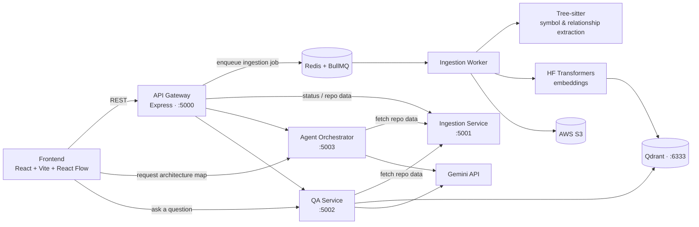

# Codebase Navigator

**AI-powered codebase onboarding — paste a GitHub repo, get an explorable architecture map and natural-language answers about how the code actually works.**

Understanding an unfamiliar codebase is one of the biggest hidden costs of joining a new team or picking up an open-source project. READMEs cover setup, not structure — so engineers spend days manually clicking through files to build a mental model of how everything connects. Codebase Navigator turns that process into minutes.

**🔗 Live demo:** [codebase-navigator-nine.vercel.app](https://codebase-navigator-nine.vercel.app/)

---

## What it does

1. **Ingest** — submit a GitHub repository URL. The repo is cloned and parsed with [Tree-sitter](https://tree-sitter.github.io/tree-sitter/) to extract symbols (functions, classes, routes, models) and their relationships (calls, imports, routes_to, mounts, etc.), as an asynchronous background job.
2. **Index** — extracted code is embedded (via Hugging Face Transformers) and stored in [Qdrant](https://qdrant.tech/) for semantic retrieval, while the parsed symbol/relationship data is assembled into a navigable repository graph.
3. **Explore** — an interactive, branch-colored mind map (built with [React Flow](https://reactflow.dev/)) visualizes the repo's architecture top-down, expandable from the root down to individual files.
4. **Ask** — ask plain-English questions like *"How does ML risk prediction work?"* and the navigation engine traces a path through the actual call graph — not just a generic LLM guess — combining Qdrant retrieval with Gemini-generated, evidence-backed answers.

---

## Why it's not just "RAG over a repo"

Most codebase-chat tools retrieve similar-looking code and summarize it. Codebase Navigator's navigation engine does more:

- **Question-intent classification** — detects whether a question is about *flow*, *dependency*, *data*, *configuration*, *location*, or *usage*, so the same question phrased differently ("how is X fetched?" vs "what does X depend on?") is handled correctly.
- **Graph-based path selection** — rather than just returning the most semantically similar chunk, it traces an actual path through the call/route/dependency graph from an entry point to the relevant implementation, so answers explain *how you'd get there*, not just *what the code says*.
- **Relevance-first scoring** — a target's relevance to the question's actual subject is weighted as the dominant signal in path selection, so a short, correct answer isn't outscored by a longer, more "well-connected" but irrelevant chain elsewhere in the codebase.
- **Graceful degradation on messy repos** — if a repository has no clean architectural layering, the system falls back to ranking files by how many other files depend on them ("start here — everything else touches it") instead of forcing a fake structure onto disorganized code.

---

## Architecture



The system runs as four independent, containerized Node/Express services connected by an async job queue (Redis + BullMQ), so repository ingestion — the slowest step — never blocks the UI or the Q&A path for repos that are already indexed.

### Services

| Service | Role | Key dependencies |
|---|---|---|
| **`apps/api-gateway`** | Public REST entry point. Receives repo-analysis requests, enqueues ingestion jobs, routes requests to the internal services. | Express, BullMQ, ioredis, Zod |
| **`services/ingestion-service`** | Clones a repo, parses it with Tree-sitter, generates embeddings, stores vectors in Qdrant and raw data in S3. Runs both an HTTP server and a separate BullMQ **worker** process for the actual async parsing/embedding job. | Tree-sitter, HF Transformers, Qdrant client, AWS S3 SDK, BullMQ |
| **`services/agent-orchestrator`** | Generates the architecture map data the frontend's mind map renders, using Gemini. | `@google/genai`, Zod |
| **`services/qa-service`** | Answers natural-language questions about the repo — the navigation engine (question analysis, candidate retrieval, graph traversal, path scoring) lives here, combining Qdrant retrieval with Gemini generation. | Qdrant client, HF Transformers, `@google/genai` |
| **`apps/frontend`** | React UI — Overview tab, and the interactive Architecture mind map. | React 19, Vite, React Flow, Tailwind CSS, React Router |

---

## Tech stack

**Frontend:** React 19, TypeScript, Vite, Tailwind CSS, React Flow (`@xyflow/react`), React Router, lucide-react
**Backend:** Node.js (ESM), TypeScript, Express 5, `tsx` (dev), Pino (structured logging), Zod (validation)
**Queue:** Redis, BullMQ (`ioredis`)
**Parsing:** Tree-sitter (`@xberg-io/tree-sitter-language-pack`)
**Embeddings:** Hugging Face Transformers (`@huggingface/transformers`)
**Vector search:** Qdrant (`@qdrant/js-client-rest`)
**Generation / reasoning:** Google Gemini (`@google/genai`)
**Object storage:** AWS S3 (`@aws-sdk/client-s3`)
**Testing:** Vitest, Supertest
**Infra:** Docker, Docker Compose

---

## Project structure

```
.
├── apps/
│   ├── api-gateway/        # Express REST gateway — job orchestration, routing
│   └── frontend/           # React + Vite + React Flow UI
├── services/
│   ├── ingestion-service/  # Clone → Tree-sitter parse → embed → Qdrant/S3
│   ├── agent-orchestrator/ # Generates the architecture map (Gemini)
│   └── qa-service/         # RAG + graph-based navigation engine for Q&A
└── infra/
    └── docker-compose.yml  # Redis, Qdrant, and all four backend services
```

> Note: `apps/frontend` is **not** included in `docker-compose.yml` — it runs separately via Vite's dev server (see below).

---

## Getting started

### Prerequisites

- Node.js 18+
- Docker and Docker Compose
- An AWS S3 bucket + credentials (ingestion storage)
- A Qdrant instance — the included `qdrant` container works for local dev; use `QDRANT_API_KEY` only if you're pointing at Qdrant Cloud instead
- A Gemini API key

### Option A — Docker Compose (fastest)

1. Create a `.env` file in `infra/` (Docker Compose reads it automatically for the `${VAR}` substitutions in `docker-compose.yml`):

   ```bash
   AWS_REGION=your-region
   AWS_ACCESS_KEY_ID=...
   AWS_SECRET_ACCESS_KEY=...
   AWS_S3_BUCKET=your-bucket-name

   QDRANT_URL=http://qdrant:6333
   QDRANT_API_KEY=            # leave blank for local Qdrant without auth

   GEMINI_API_KEY=your-gemini-key
   ```

2. Start everything except the frontend:

   ```bash
   cd infra
   docker compose up --build
   ```

   This brings up Redis, Qdrant, `api-gateway` (:5000), `ingestion-service` (:5001), `qa-service` (:5002), and `agent-orchestrator` (:5003).

   > Check your `ingestion-service` Dockerfile confirms the BullMQ **worker** (`npm run worker`) is actually started alongside the server (`npm start`) — the queue won't process jobs if only the HTTP server is running.

3. In a separate terminal, run the frontend:

   ```bash
   cd apps/frontend
   npm install
   npm run dev
   ```

4. Open `http://localhost:5173`.

### Option B — Running services individually (for active development)

```bash
# 1. Start just the infra containers
cd infra
docker compose up redis qdrant

# 2. For each backend service, in its own terminal:
cd apps/api-gateway        # or services/ingestion-service, services/qa-service, services/agent-orchestrator
npm install
npm run dev                # tsx watch src/server.ts

# 3. ingestion-service also needs its worker running (separate terminal):
cd services/ingestion-service
npm run build
npm run worker             # node dist/queue/ingestion.worker.js

# 4. Frontend
cd apps/frontend
npm install
npm run dev
```

Each backend service needs its own `.env` — see the `environment:` block for that service in `infra/docker-compose.yml` for the exact variable names it expects (ports default to 5000 / 5001 / 5002 / 5003 respectively).

---

## Known limitations

- **Public repos only** — private repository access isn't currently supported.
- **Large repositories** — ingestion time (cloning, parsing, embedding) scales with repo size; the mind map itself stays readable via collapse/expand regardless of repo size.
- **Naming-convention dependent grouping** — the architecture graph groups related layers using a `"Group - Subname"` naming convention in extracted layer names; repos that don't produce this convention fall back to an importance-ranked file view instead of a grouped hierarchy.

---

## Roadmap

- [ ] Private repository support (GitHub OAuth)
- [ ] Inline file explanations in the mind map (click a leaf, get a plain-English summary)
- [ ] Multi-repo comparison view
- [ ] Shareable, read-only analysis links

---

## License

This project is licensed under the MIT License. See the [LICENSE](LICENSE) file for details.
